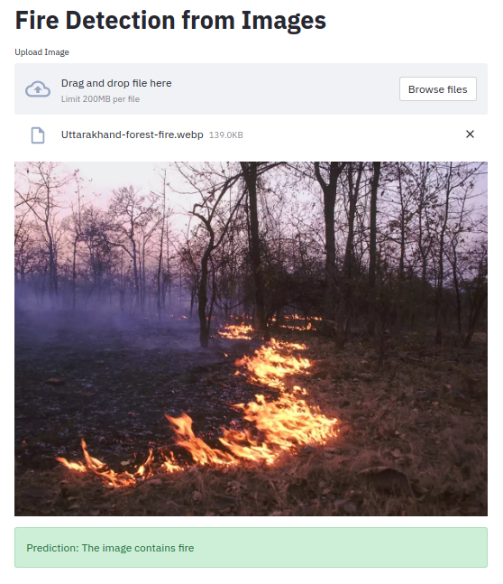

IPYNB viewer not loading? View it here: (https://nbviewer.jupyter.org/github/holdmygithub/Data-Science/blob/master/CV-End-toEnd-Fire-Detection-Images/fire-detection-in-images.ipynb)
## 1) [Fire Detection from images (End to End Project, Image Classification)](https://github.com/holdmygithub/Data-Science/tree/master/End-toEnd-CV-Fire-Detection-Images)
**Objective: Predicting whether a given image contains fire or not.**
Key Steps Involved:

- Exploratory data analysis
- Image preprocessing
- Image augmentation using image data generator
- Creation of model 1 from scratch (CNN)
- Creation of model 2 using pre-trained Xception with extra added layers
- Model evaluation
- Deployment using StreamLit
- Containerization using Docker

Data Source: https://www.kaggle.com/phylake1337/fire-dataset
