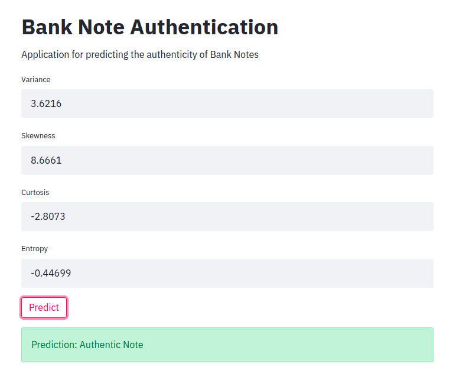
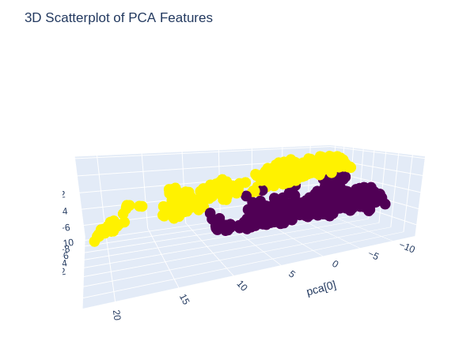

## [Bank Note Authentication (End to End Project, PySpark)](https://github.com/holdmygithub/Data-Science/tree/master/EndtoEnd-PySpark-BankNoteAuthentication)
**Objective: Predicting whether a given bank note is fake or authentic.**
Key Steps Involved:

- Exploratory data analysis using PySpark
- PCA analysis, feature engineering
- Building and tuning Machine Learning models
- Deployment using StreamLit
- Containerization using Docker
- Bash Script to orchestrate Docker containerization

#### Instructions for docker containerization

a) Install Docker

      sudo snap install docker
      
b) Run "run_app.sh"

	./run_app.sh

Data Source: https://www.kaggle.com/ritesaluja/bank-note-authentication-uci-data
