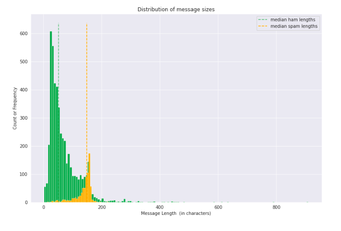

IPYNB File not loading? View it here: (https://nbviewer.jupyter.org/github/holdmygithub/Data-Science/blob/master/NLP-End-to-End-SMS-Spam-Classification/sms-spam-analysis.ipynb)

### 2) [SMS Spam Classification (End to End Project, Natural Language Processing)](https://github.com/holdmygithub/Data-Science/tree/master/End-to-End-NLP-SMS-Spam-Classification)
**Objective: Predicting whether a given SMS is spam**

Key Steps Involved:

- Text cleaning and preparation
- Vectorizing texts and feature engineering
- Training and tuning machine learning models
- Model evaluation
- Model deployment using flask

Data Source: https://archive.ics.uci.edu/ml/datasets/sms+spam+collection
