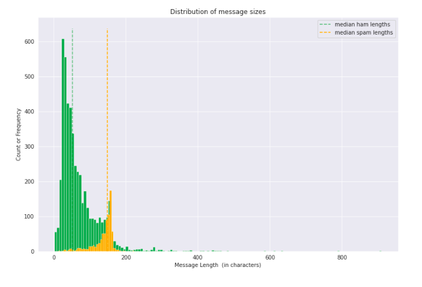

### 2) [SMS Spam Classification (Natural Language Processing)](https://github.com/holdmygithub/Data-Science/tree/master/NLP-SMS-Spam-Classification)
**Objective: Predicting whether a given SMS is spam**
Key Steps Involved:

- Text cleaning and preparation
- Vectorizing texts and feature engineering
- Training and tuning machine learning models
- Model evaluation

