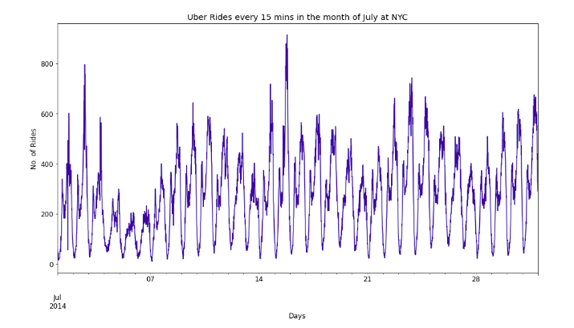
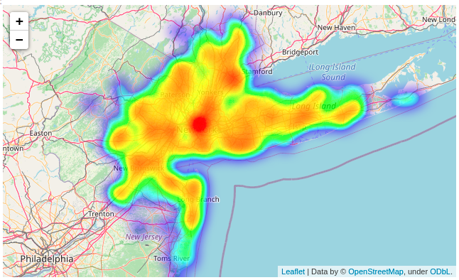

### 3) [Uber_Data_Analysis-EDA](https://github.com/holdmygithub/Data-Science/tree/master/Uber_Data_Analysis-EDA "Uber_Data_Analysis-EDA")
**Objective: Exploratory data analysis of uber pickups in new york city**
Ipynb file is large and may fail to load in github. Please refresh.
Key Steps Involved:

- Exploratory data analysis, Pickup pattern identification
- Extensive data visualization
- Feature correlations
- Statistical tests

<figure>

<figcaption> Uber pickups vs Time plot </figcaption>
</figure>
<figure>

<figcaption> Uber pickups heatmap </figcaption>
</figure>

